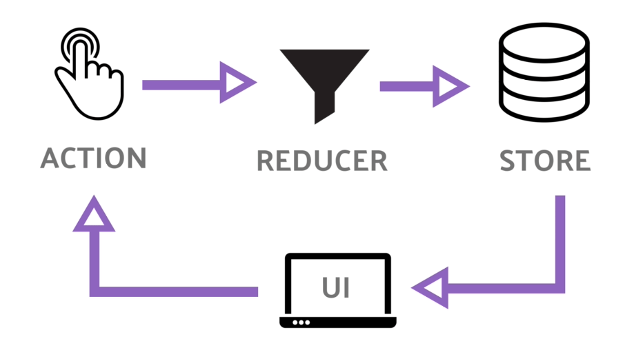

# Redux 使用总结

## Redux

### Redux 和 React-redux

> Redux 是 JavaScript 状态容器，提供可预测化的状态管理。 —— Redux 中文文档

Redux 和 React-redux 并不是同一个东西。

Redux 是一种架构模式（Flux 架构的一种变种），它不关注你到底用什么库，你可以把它应用到 React 和 Vue，甚至跟 jQuery 结合都没有问题。

而 React-redux 就是把 Redux 这种架构模式和 React.js 结合起来的一个库，就是 Redux 架构在 React.js 中的体现。

### Redux 三大原则

- 单一数据源：store
- State 是只读的，唯一改变 state 的方法就是触发 action，action 是一个用于描述已发生事件的普通对象
- 使用纯函数来修改，如 reducer，它接收先前的 state 和 action，并返回新的 state

### Redux 流程图



### Redux 为什么这么用

我们在代码中发现共享的状态如果可以被任意修改的话，那么程序的行为将非常不可预料，所以我们提高了修改数据的门槛：你必须通过 dispatch 执行某些允许的修改操作，而且必须大张旗鼓的在 action 里面声明。

这种模式挺好用的，我们就把它抽象出来一个 createStore，它可以产生 store，里面包含 getState 和 dispatch 函数，方便我们使用。

后来发现每次修改数据都需要手动重新渲染非常麻烦，我们希望自动重新渲染视图。所以后来加入了订阅者模式，可以通过 store.subscribe 订阅数据修改事件，每次数据更新的时候自动重新渲染视图。

接下来我们发现了原来的“重新渲染视图”有比较严重的性能问题，我们引入了“共享结构的对象”来帮我们解决问题，这样就可以在每个渲染函数的开头进行简单的判断避免没有被修改过的数据重新渲染。

我们优化了 stateChanger 为 reducer，定义了 reducer 只能是纯函数，功能就是负责初始 state，和根据 state 和 action 计算具有共享结构的新的 state。

createStore 现在可以直接拿来用了，套路就是：

```js
// 定一个 reducer
function reducer (state, action) {
  /* 初始化 state 和 switch case */
}

// 生成 store
const store = createStore(reducer)

// 监听数据变化重新渲染页面
store.subscribe(() => renderApp(store.getState()))

// 首次渲染页面
renderApp(store.getState())

// 后面可以随意 dispatch 了，页面自动更新
store.dispatch(...)
```

以上内容原文见这里：[动手实现 Redux（六）：Redux 总结](http://huziketang.mangojuice.top/books/react/lesson35)

### Redux 使用

```js
import { createStore } from 'redux'

/* 创建reducer
 ** 可以使用单独的一个reducer,也可以将多个reducer合并为一个reducer，即：combineReducers()
 ** action发出命令后将state放入reucer加工函数中，返回新的state,对state进行加工处理
 */
const reducer = (state = { counter: 0 }, action) => {
  switch (action.type) {
    case 'INCREASE':
      return { counter: state.counter + 1 }
    case 'DECREASE':
      return { counter: state.counter - 1 }
    default:
      return state
  }
}

/* 创建action
 ** 用户是接触不到state的，只能有view触发，所以，这个action可以理解为指令，需要发出多少动作就有多少指令
 ** action是一个对象，必须有一个叫type的参数，定义action类型
 */
const actions = {
  increase: () => ({ type: 'INCREASE' }),
  decrease: () => ({ type: 'DECREASE' }),
}

/* 创建的store，使用createStore方法
 ** store 可以理解为有多个加工机器的总工厂
 ** 提供subscribe，dispatch，getState这些方法。
 */

const store = createStore(reducer)

store.subscribe(() => console.log(store.getState()))

store.dispatch(actions.increase()) // {counter: 1}
store.dispatch(actions.increase()) // {counter: 2}
store.dispatch(actions.increase()) // {counter: 3}
store.dispatch(actions.decrease()) // {counter: 2}
```

## 参考资料

- [动手实现 Redux（一）：优雅地修改共享状态](http://huziketang.mangojuice.top/books/react/lesson30)
- [Redux 中文文档](http://cn.redux.js.org/)
